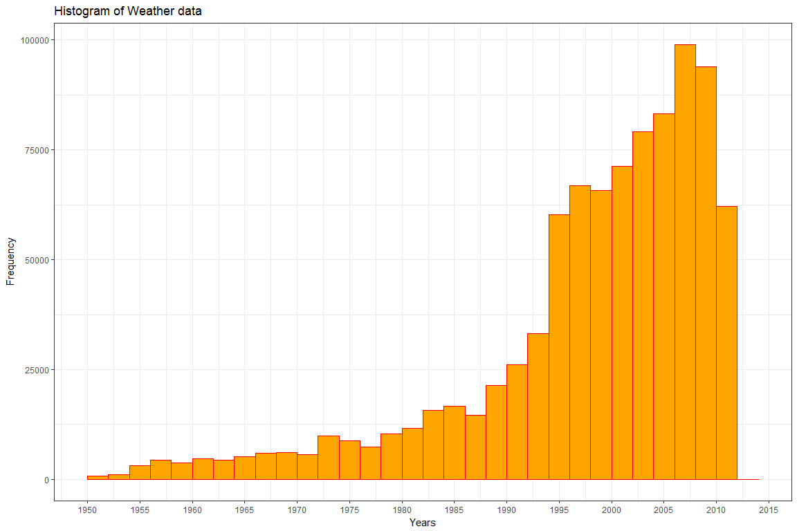
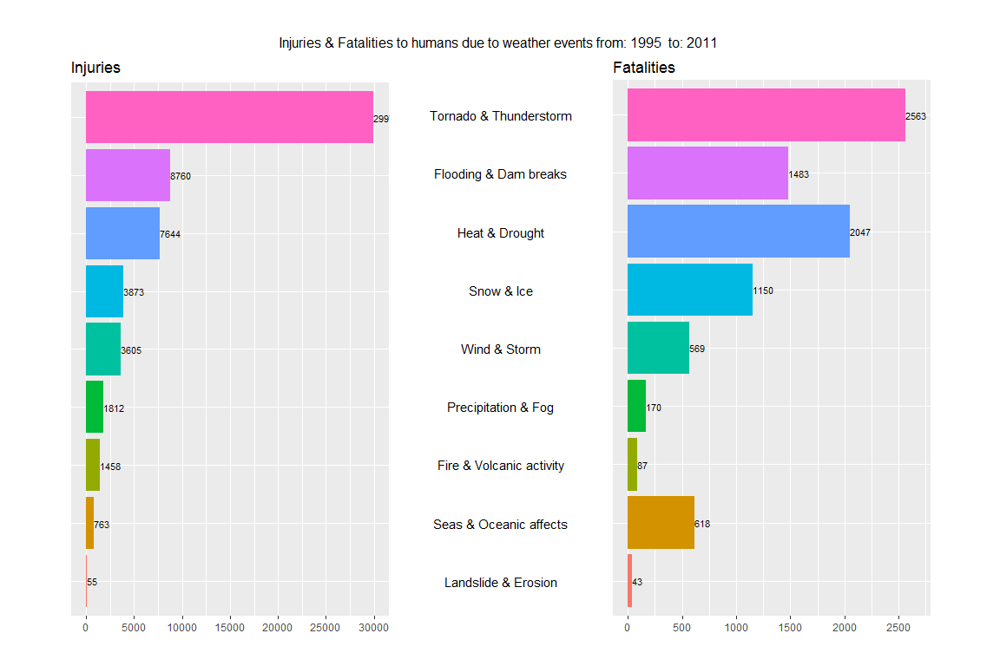
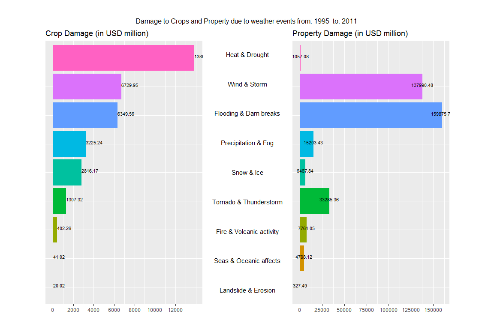

# Severe Weather Event Data Analysis - NOAA
Sanjay Somraj  
February 26, 2017  


# Impact Analysis of different weather events based on the  U.S. National Oceanic and Atmospheric Administration's (NOAA) storm database

## Reproducible Research: Peer Assessment 2

-----

### 1. Assignment

The basic goal of this assignment is to explore the NOAA Storm Database and answer some basic questions about severe weather events. You must use the database to answer the questions below and show the code for your entire analysis. Your analysis can consist of tables, figures, or other summaries. You may use any R package you want to support your analysis.

-----

### 2. Synopsis
The National Oceanic and Atmospheric Administration (NOAA) maintains a public database for storm events occured in the United States of America. The data contains the type of storm event, details like location, date, estimates for damage to property as well as the number of human victims of the storm. 

This project involves exploring the U.S. National Oceanic and Atmospheric Administration's (NOAA) storm database. Analyzing this data, we will answer the following questions:

* Which events caused highest damage to population life - Fatalities & Injuries?
* Which events had the greatest economic consequences - Financial Losses?

-----

### 3. Data Processing
##### 3.1. Load libraries
* Libraries to perform loading, computation, transformation and plotting of data

```r
library(dplyr)
library(ggplot2)
library(grid)
library(gridExtra)
```
##### 3.3. Load the data
* Read the source data (.csv) file

```r
  noaaStormData <- read.csv("./data/StormData.csv")
```

##### 3.4. Remove unwanted colums (not used for this analysis)
* Retain only required columns needed for analysis: 
* BGN_DATE, EVTYPE, FATALITIES, INJURIES, PROPDMG, PROPDMGEXP, CROPDMG, CROPDMGEXP


```r
  neededColumns <- c("BGN_DATE", "EVTYPE", "FATALITIES", "INJURIES", 
                     "PROPDMG", "PROPDMGEXP", "CROPDMG", "CROPDMGEXP")
  essentialStormData <- noaaStormData[, neededColumns]
  names(essentialStormData) <- c("Date", "EventType", "Fatalities", 
                                 "Injuries", "PropertyDamage", "PropertyDamageUnit",
                                 "CropDamage", "CropDamageUnit")
  
  essentialStormData$Year <- as.numeric(format(as.Date(essentialStormData$Date, 
                                                       format = "%m/%d/%Y %H:%M:%S"), 
                                               "%Y"))
```

##### 3.5. Observation on DamageUnit data
* The measurement unit values of **PropertyDamage** and **CropDamage** are stored in **PropertyDamageUnit** and **CropDamageUnit** respectively .The amount values will have to normalized.

```r
unique(essentialStormData$PropertyDamageUnit)
```

```
##  [1] K M   B m + 0 5 6 ? 4 2 3 h 7 H - 1 8
## Levels:  - ? + 0 1 2 3 4 5 6 7 8 B h H K m M
```

```r
unique(essentialStormData$CropDamageUnit)
```

```
## [1]   M K m B ? 0 k 2
## Levels:  ? 0 2 B k K m M
```
In these units:  
-    B refers to BILLIONS  
-    M/m refers to MILLIONS  
-    K refers to THOUSANDS  
-    H/h refers to HUNDREDS  
-    0-9 are in TENS  
-    And values are ?, -, + will be considered as invalid data or bad data

We will have to translate all damage amounts in to a uniform measure, Unit dollars


```r
unitConversion <- function(convdataset = testdata, amount, unit) {
     multiplier <- paste(amount, "Multiplier", sep = "")
     newAmount <- paste(amount, "New", sep = "")
     convdataset[multiplier] <- 0
     notNAFlag <- !is.na(toupper(convdataset[, unit])) # To ensure that NAs are not considered.
     
     convdataset[notNAFlag & toupper(convdataset[, unit]) == "B", multiplier] <- "9"
     convdataset[notNAFlag & toupper(convdataset[, unit]) == "9", multiplier] <- "9"
     convdataset[notNAFlag & toupper(convdataset[, unit]) == "8", multiplier] <- "8"
     convdataset[notNAFlag & toupper(convdataset[, unit]) == "7", multiplier] <- "7"
     convdataset[notNAFlag & toupper(convdataset[, unit]) == "M", multiplier] <- "6"
     convdataset[notNAFlag & toupper(convdataset[, unit]) == "6", multiplier] <- "6"
     convdataset[notNAFlag & toupper(convdataset[, unit]) == "5", multiplier] <- "5"
     convdataset[notNAFlag & toupper(convdataset[, unit]) == "4", multiplier] <- "4"
     convdataset[notNAFlag & toupper(convdataset[, unit]) == "H", multiplier] <- "2"
     convdataset[notNAFlag & toupper(convdataset[, unit]) == "K", multiplier] <- "3"
     convdataset[notNAFlag & toupper(convdataset[, unit]) == "3", multiplier] <- "3"
     convdataset[notNAFlag & toupper(convdataset[, unit]) == "2", multiplier] <- "2"
     convdataset[notNAFlag & toupper(convdataset[, unit]) == "1", multiplier] <- "1"
     convdataset[notNAFlag & toupper(convdataset[, unit]) == "", multiplier]  <- "0"
     convdataset[is.na(convdataset[unit]), multiplier] <- 0

     convdataset[newAmount] <- 
          convdataset[,amount] * 10^as.numeric(convdataset[,multiplier])
     return(convdataset)
}
```

**unitConversion** is a function written to normalize the Damage amounts into unit Dollars. This function takes 3 arguments  
-    1. data frame  
-    2. column for damage amount  
-    3. column for respective damage amount units  

This function, after executing, will create 2 columns in the data frame.  
-    **Multiplier** - Number of times a amount should be multiplied to relfect in equal million value  
     e.g.  
     a) A billion should be muliplied by 10 ^ 9 to convert into units  
     b) A hundred should be multiplied by 10 ^ 2  
-    **NewAmount** - This column will have the product of the Amount with Multiplier  


```r
essentialStormData <- unitConversion(essentialStormData,
                                     "PropertyDamage", 
                                     "PropertyDamageUnit")

essentialStormData <- unitConversion(essentialStormData,
                                     "CropDamage", 
                                     "CropDamageUnit")
```


### 4. Identifying & subsetting significant data  
#### 4.1 Identify Years with significant number of events  
The FAQ document states that although the weather events data is collected from 1950s, better data is available for the last 2 decades.  
Let us try to identify a suitable cut-off year for our analysis.  We'll plot a Histogram for this purpose.

```r
ggplot(essentialStormData, aes(x = Year)) + 
     geom_histogram(col="red", 
                    fill = "orange", 
                    binwidth = 1,
                    breaks=seq(1950, 2015, by=2)) + 
     labs(title="Histogram of Weather data", 
          x = "Years", 
          y = "Frequency") + 
     scale_x_continuous(breaks=seq(1950, 2015, by=5))+
     theme_bw() 
```

<!-- -->

Based on the histogram, we can say that 1995 can be a suitable year to set consider as CUT-OFF year.


```r
CutOffYear <- 1995
essentialStormData <- essentialStormData[essentialStormData$Year > CutOffYear,]
LastYear <- max(essentialStormData$Year)
```

#### 4.2 Identify and categorizing different events  
The storm data records details for 985 unique source events. This number can be reduced grouping similar events. We will have 9 levels defined which will cover the majority of the events.  

**NOTE:**  
We have ignored the following 171 events  
a) summaries  
b) OTHER/Other  
c) specified as NONE  
d) Seiche  
e) do not specify clearly the event


```r
StormDamageDataGroup  <- essentialStormData

StormDamageDataGroup[grepl("precipitation|rain|hail|drizzle|wet|
                           precip|burst|depression|fog|wall cloud", 
                         StormDamageDataGroup$EventType, ignore.case = TRUE), 
                   "DamageEventGroup"] <- "Precipitation & Fog"

StormDamageDataGroup[grepl("dust|saharan|wind|storm|wnd|hurricane|typhoon", 
                         StormDamageDataGroup$EventType, ignore.case = TRUE), 
                   "DamageEventGroup"] <- "Wind & Storm"

StormDamageDataGroup[grepl("slide|erosion|slump", 
                         StormDamageDataGroup$EventType, ignore.case = TRUE), 
                   "DamageEventGroup"] <- "Landslide & Erosion"

StormDamageDataGroup[grepl("warmth|warm|heat|dry|hot|drought|thermia|
                           temperature record|record temperature|record high", 
                         StormDamageDataGroup$EventType, ignore.case = TRUE), 
                   "DamageEventGroup"] <- "Heat & Drought"

StormDamageDataGroup[grepl("cold|cool|ice|icy|frost|freeze|snow|winter|wintry|
                           wintery|blizzard|chill|freezing|avalanche|glaze|sleet", 
                         StormDamageDataGroup$EventType, ignore.case = TRUE), 
                   "DamageEventGroup"] <- "Snow & Ice"

StormDamageDataGroup[grepl("flood|surf|blow-out|swells|fld|dam break", 
                         StormDamageDataGroup$EventType, ignore.case = TRUE), 
                   "DamageEventGroup"] <- "Flooding & Dam breaks"

StormDamageDataGroup[grepl("seas|high water|tide|tsunami|wave|current|marine|drowning", 
                         StormDamageDataGroup$EventType, ignore.case = TRUE), 
                   "DamageEventGroup"] <- "Seas & Oceanic affects"

StormDamageDataGroup[grepl("tstm|thunderstorm|lightning|tornado|spout|funnel|whirlwind", 
                         StormDamageDataGroup$EventType, ignore.case = TRUE), 
                   "DamageEventGroup"] <- "Tornado & Thunderstorm"

StormDamageDataGroup[grepl("fire|smoke|volcanic", 
                         StormDamageDataGroup$EventType, ignore.case = TRUE), 
                   "DamageEventGroup"] <- "Fire & Volcanic activity"

# remove uncategorized records (DamageEventGroup == NA) & cast as factor
StormDamageDataGroup <- 
     StormDamageDataGroup[complete.cases(StormDamageDataGroup[, "DamageEventGroup"]), ]

StormDamageDataGroup$DamageEventGroup <- as.factor(StormDamageDataGroup$DamageEventGroup)
groups <- levels(StormDamageDataGroup$DamageEventGroup)
```

These events are grouped in theo following categories:  
Fire & Volcanic activity, Flooding & Dam breaks, Heat & Drought, Landslide & Erosion, Precipitation & Fog, Seas & Oceanic affects, Snow & Ice, Tornado & Thunderstorm, Wind & Storm  

#### 4.3 Consolidate data for results  
**Here we are preparing the data for the Plots**  
-    **Step 1:** Aggregate the Property and Crop damage as Economic damage  


```r
TotalEconomicDamage <- aggregate(cbind(PropertyDamageNew, CropDamageNew) ~ DamageEventGroup, 
                                 data=StormDamageDataGroup, FUN=sum, na.rm=TRUE)

TotalEconomicDamage <- TotalEconomicDamage[order(TotalEconomicDamage$CropDamageNew, 
                                                 decreasing=TRUE),]

rownames(TotalEconomicDamage$DamageEventGroup) <- NULL
TotalEconomicDamage$DamageEventGroup <- 
     factor(TotalEconomicDamage$DamageEventGroup,
            levels = rev(TotalEconomicDamage$DamageEventGroup))
```

-    **Step 2:** Aggregate the Fatalities and Injuries damage as Life damage  


```r
TotalLifeDamage <- aggregate(cbind(Fatalities,Injuries) ~ DamageEventGroup, 
                             data=StormDamageDataGroup, 
                             FUN=sum, na.rm=TRUE)

TotalLifeDamage <- TotalLifeDamage[order(TotalLifeDamage$Injuries, 
                                         decreasing=TRUE),]

rownames(TotalLifeDamage$DamageEventGroup) <- NULL
TotalLifeDamage$DamageEventGroup <- 
     factor(TotalLifeDamage$DamageEventGroup, 
            levels = rev(TotalLifeDamage$DamageEventGroup))
```

### 5. Summary - Life Damage
#### 5.1 The results for Economic Damage - Property and Crop

```
##   DamageEventGroup         PropertyDamageNew CropDamageNew
## 3 Heat & Drought             1057077300      13860159500  
## 9 Wind & Storm             137990482290       6729948600  
## 2 Flooding & Dam breaks    159875724170       6349563200  
## 5 Precipitation & Fog       15203426360       3225242250  
## 7 Snow & Ice                 6467844450       2816170100  
## 8 Tornado & Thunderstorm    33285359370       1307316050  
## 1 Fire & Volcanic activity   7761049500        402255130  
## 6 Seas & Oceanic affects     4798122340         41022500  
## 4 Landslide & Erosion         327494100         20017000
```

#### 5.2 The results for Life Damage - Injuries and Fatalities

```
##   DamageEventGroup         Fatalities Injuries
## 8 Tornado & Thunderstorm   2563       29975   
## 2 Flooding & Dam breaks    1483        8760   
## 3 Heat & Drought           2047        7644   
## 7 Snow & Ice               1150        3873   
## 9 Wind & Storm              569        3605   
## 5 Precipitation & Fog       170        1812   
## 1 Fire & Volcanic activity   87        1458   
## 6 Seas & Oceanic affects    618         763   
## 4 Landslide & Erosion        43          55
```

### 6. Plots
#### 6.1 Preparation
1)   The plots for Life and Economic damages will be prepared using ggplot.  
2)   Each of the bar chart will have 3 plots  
     a)   1 plot will have only the Labels of weather events  
     b)   1 plot for each of the categories (Life: Fatalities Vs Injuries, Economic: Property Vs Crop)  
3)   The bar chart will have a layout: **Data plot 1 - Label Plot - Data Plot 2**  
4)   Two new functions are written to help prepare the layout and include the plot in the layout  
     a) **multiplot** function will create the new grid page and set up the view  
     b) **plotLayout** function will set tup the plots as per the given coordinates  
     

```r
# The layout for plot on Life damages
Layout1 = grid.layout(2, 3, heights = unit(c(0.3,7), "inches"),
                      widths = unit(c(4,2.5,4), "inches"))

# The layout for plot on Economic damages
Layout2 = grid.layout(2, 3, heights = unit(c(0.3,7), "inches"), 
                      widths = unit(c(4,2,4), "inches"))

# plotLayout function will set tup the plots as per the given coordinates
plotLayout <- function(x, y) viewport(layout.pos.row = x,
                                   layout.pos.col = y)

# multiplot function will create the new grid page and set up the view  
multiplot <- function(Layout, a, b, c, d) {
     grid.newpage()
     pushViewport(viewport(layout = Layout))
     grid.text(a, vp = viewport(layout.pos.row = 1, layout.pos.col = 1:3))
     print(b, vp = plotLayout(2, 1))
     print(c, vp = plotLayout(2, 2))
     print(d, vp = plotLayout(2, 3))
}
```
#### 6.2 Life Damages - Injuries Vs. Fatalities
Please see below the code and plot for Damages to human life due to severe weather events, resulting in Death and injuries.


```r
plotTitle1 = paste(c("Injuries & Fatalities to humans due to weather events from:",
                     CutOffYear," to:",LastYear), 
                   collapse = " ")
g.LifeLabels <- ggplot(data=TotalLifeDamage, 
                       aes(x=1,y=DamageEventGroup)) +
     geom_text(aes(label=DamageEventGroup), size=4) +
     ggtitle("") +
     ylab(NULL) +
     scale_x_continuous(expand=c(0,0),limits=c(1,1)) +
     theme(axis.title=element_blank(),
           panel.grid=element_blank(),
           axis.text.y=element_blank(),
           axis.ticks.y=element_blank(),
           panel.background=element_blank(),
           axis.text.x=element_text(color=NA),
           axis.ticks.x=element_line(color=NA))

# Plot chart with injuries
yLim1 <- max(TotalLifeDamage$Injuries+100)
g.Injuries <- ggplot(data=TotalLifeDamage, 
                     aes(x=DamageEventGroup, 
                         y=Injuries),
                         fill = factor(Injuries)) +
     geom_bar(stat = "identity", aes(fill = factor(DamageEventGroup))) + 
     geom_text(aes(label=Injuries), size=3, vjust=0.5, hjust=0.0) +
     ggtitle("Injuries") +
     scale_y_continuous(limits = c(0,yLim1), breaks = seq(0,yLim1,5000)) +
     coord_flip() +
     theme(axis.title.x = element_blank(), 
           axis.title.y = element_blank(), 
           axis.text.y = element_blank(), 
           axis.ticks.y = element_blank(), 
           legend.position = "none")

# Plot chart with fatalities
yLim2 <- max(TotalLifeDamage$Fatalities+100)
g.Fatalities <- ggplot(data=TotalLifeDamage, 
                       aes(x=DamageEventGroup, 
                           y=Fatalities, 
                           fill = factor(DamageEventGroup))) +
     geom_bar(stat = "identity") + 
     geom_text(aes(label=Fatalities), size=3, vjust=0.5, hjust=0.0) +
     ggtitle("Fatalities") +
     coord_flip() +
     scale_y_continuous(limits = c(0,yLim2), breaks = seq(0, yLim2, 500)) +
     theme(axis.title.x = element_blank(), 
           axis.title.y = element_blank(), 
           axis.text.y = element_blank(), 
           axis.ticks.y = element_blank(), 
           legend.position = "none")

# We will combine both the plots in to one.
multiplot(Layout1, plotTitle1,  g.Injuries, g.LifeLabels, g.Fatalities)
```

<!-- -->

#### 6.3 Economic Damages - Property & Crop
Please see below the code and plot for Economic Damages to Property Vs Crop due to severe weather events 


```r
plotTitle2 = paste(c("Damage to Crops and Property due to weather events from:",
                     CutOffYear," to:",LastYear), 
                   collapse = " ")

# Plot chart with Damage group labels  
g.EconLabels <- ggplot(data=TotalEconomicDamage, 
                       aes(x=1,y=DamageEventGroup)) +
     geom_text(aes(label=DamageEventGroup), size=4) +
     ggtitle("") +
     ylab(NULL) +
     scale_x_continuous(expand=c(0,0),limits=c(1,1)) +
     theme(axis.title=element_blank(),
           panel.grid=element_blank(),
           axis.text.y=element_blank(),
           axis.ticks.y=element_blank(),
           panel.background=element_blank(),
           axis.text.x=element_text(color=NA),
           axis.ticks.x=element_line(color=NA),
           plot.margin = unit(c(0,0,0,0), "mm"))

# Plot chart with Property damages
yLim3 <- max((TotalEconomicDamage$PropertyDamageNew/1000000)+500)
g.Property <- ggplot(data=TotalEconomicDamage, 
                     aes(x=DamageEventGroup, 
                         y=PropertyDamageNew/1000000, 
                         label=sprintf("%0.2f", 
                                       round(PropertyDamageNew/1000000, 
                                             digits = 2))),
                     fill = factor(round(PropertyDamageNew/1000000, 
                                         digits = 2))) +
     geom_bar(stat = "identity", aes(fill = factor(DamageEventGroup))) + 
     geom_text(size=3, aes(label=round(PropertyDamageNew/1000000, 
                                       digits = 2)),
               vjust=0.0, hjust=0.5) +
     ggtitle("Property Damage (in USD million)") +
     scale_y_continuous(limits = c(0,yLim3), breaks = seq(0,yLim3,25000)) +
     coord_flip() +
     theme(axis.title.x = element_blank(), 
           axis.title.y = element_blank(), 
           axis.text.y = element_blank(), 
           axis.ticks.y = element_blank(), 
           legend.position = "none")

# Plot chart with Crop damages  
yLim4 <- max((TotalEconomicDamage$CropDamageNew/1000000)+100)
g.Crop <- ggplot(data=TotalEconomicDamage, 
                 aes(x=DamageEventGroup, 
                     y=CropDamageNew/1000000,
                     label=sprintf("%0.2f", 
                                   round(CropDamageNew/1000000, 
                                         digits = 2))),
                 fill = factor(round(CropDamageNew/1000000, 
                                     digits = 2))) +
     geom_bar(stat = "identity", aes(fill = factor(DamageEventGroup))) + 
     geom_text(size=3, aes(label=round(CropDamageNew/1000000, 
                                       digits = 2), 
                           vjust=0.0, hjust=0.0)) +
     ggtitle("Crop Damage (in USD million)") +
     scale_y_continuous(limits = c(0,yLim4), breaks = seq(0,yLim4,2000)) +
     coord_flip() +
     theme(axis.title.x = element_blank(), 
           axis.title.y = element_blank(), 
           axis.text.y = element_blank(), 
           axis.ticks.y = element_blank(), 
           legend.position = "none")

multiplot(Layout2, plotTitle2, g.Crop, g.EconLabels,g.Property)
```

<!-- -->

## SUMMARY 
This is the summary of damages caused due to severe weather events occured during the period **1995 to 2011**.

### A)    Human Life Damages - Injuries & Fatalities
*    The **Tornado, Thuderstorm & Lightning** group has caused highest damages for human life in both the Fatalities and Injuries.

### B)    Economic Damages - Property & Crop
1)   The **Heat & Drought** group has caused highest damages for Crops with USD 13.86 billion  
2)   The **Flooding & Dam breakages** group has caused highest damages for Property with USD 13.86 billion

### C)    Data used for this analysis  
*    The data used for this analysis is stored and to reproduce the plot and results later.


```r
save(essentialStormData,
     StormDamageDataGroup,
     TotalEconomicDamage,
     TotalLifeDamage,
     CutOffYear,
     LastYear,
     file = "./data/NOAAStormAnalysisData.RData")
```

-----------------END OF ANALYSIS REPORT-------------------
